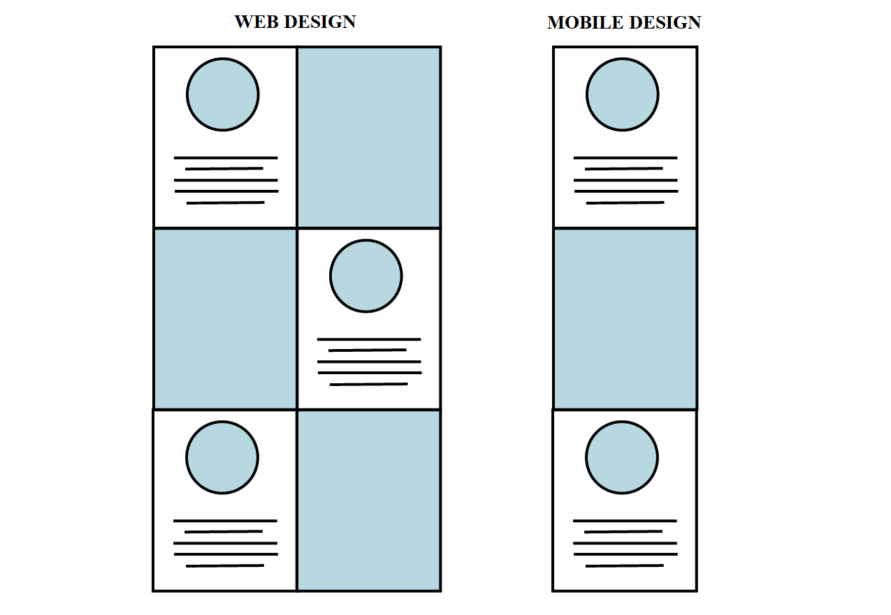

# Project Webite
Deploy Page: https://beckyydo.github.io/

Website to showcase projects I've completed while also providing further information about myself both professionally and personally.

Tools: HTML, CSS

Images were retrieved from open source websites and redesigned using various online tools below.

Tools: LunaPic, Fotor, Flaticon, Freepik

## Home 
The idea behind the home page was to able to give a brief summary to the sections of the website and give some insights to who am I.
The design of the homepage was to have a checkerboard layout and then have the mobile layout convert the checkerboard to a vertical layout.

## About Me
About section will provide some information to provide a better understand of me. It will also describe my education and also my technical skills. This section will
include my contact information in the event you need more information or questions.

## Projects
The project page will have 2 sections. First section will include my resume with the ability to download it. Second section
will include pages of my projects both done professionally and through my education. The idea behind this section was to provide a brief summary
of the purpose of the project with a preview image and animated image to demonstrate the project page. Include at the bottom of each project would be 
access to the github with the code and the option to deploy the project page in a new tab.

## Baking
This section will feature a gallery on the various desserts I've baked and also the reciepes used to create them.

## Climbing
This section will include a gallery on my climbing trip and also provide details on my experiences with a new interesting climb and the things I have learned.
